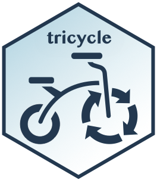

# tricycle

<!-- badges: start -->
[](https://github.com/hansenlab/tricycle/actions)

<!-- badges: end -->

## Bioconductor release status

|      Branch      |    R CMD check   | Last updated |
|:----------------:|:----------------:|:------------:|
| [_devel_](http://bioconductor.org/packages/devel/bioc/html/tricycle.html) | [](http://bioconductor.org/checkResults/devel/bioc-LATEST/tricycle) |  |
| [_release_](http://bioconductor.org/packages/release/bioc/html/tricycle.html) | [](http://bioconductor.org/checkResults/release/bioc-LATEST/tricycle) |  |

## Installation

```r
if (!requireNamespace("BiocManager", quietly = TRUE))
    install.packages("BiocManager")
BiocManager::install("tricycle", dependencies = TRUE)


